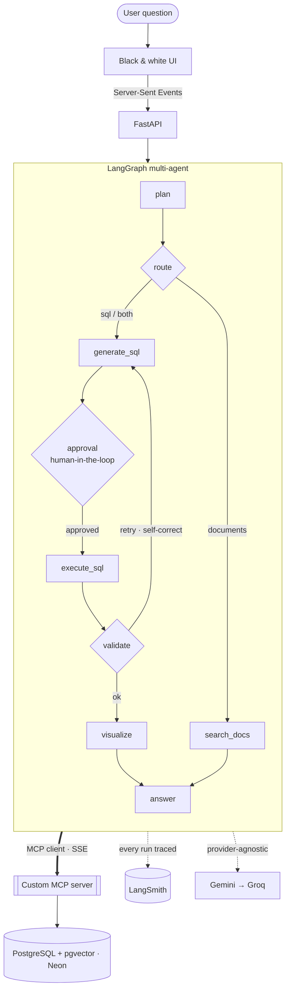

<div align="center">

# 🧭 Atlas — Multi-Agent AI Analyst

**Ask your business data anything in plain English. A team of agents plans, queries a SQL + vector database through an MCP server, validates and self-corrects, then writes a clear, charted, fully-sourced answer — pausing for your approval before anything sensitive.**

[](https://www.python.org/)
[](https://www.langchain.com/langgraph)
[](https://modelcontextprotocol.io/)
[](https://github.com/pgvector/pgvector)
[](https://smith.langchain.com/)
[](LICENSE)

### 🔗 [**Live demo**](https://roshaanullahzaheer-atlas.hf.space) — a multi-agent analyst you can watch think

</div>

---

## ✨ What it does

Most "chat with your data" demos are a single model call that writes SQL and hopes. **Atlas is a real multi-agent system** you can watch reason, step by step:

1. 🧭 **Plans** the question and routes it — structured SQL, semantic document search, or both.
2. 🛠️ **Calls tools through a custom MCP server** (`run_sql`, `search_documents`, `get_schema`). The agent is the MCP **client**; the database is reached only over the wire.
3. 🧮 **Queries PostgreSQL + pgvector** — exact analytics over the tables, semantic search over documents.
4. ✅ **Validates & self-corrects** — a wrong or empty query is critiqued against the schema, rewritten, and retried automatically.
5. ✋ **Pauses for human approval** before anything sensitive (e.g. reading personal data or an unbounded scan) — a LangGraph `interrupt`.
6. 📊 **Visualizes** — an agent picks the right chart for the result.
7. ✍️ **Answers** in grounded, well-structured prose with inline document citations.
8. 🔍 **Stays a glass box** — every answer shows the exact SQL it ran, the rows, the validation verdict, and is traced in LangSmith.

## 🏗️ Architecture



The agent never touches the database directly — it goes through the **MCP server** (SSE transport), which enforces a read-only, time-boxed, row-capped query guard before anything reaches Postgres.

## 🧱 Tech

| Concern | Choice |
|---|---|
| Orchestration | **LangGraph** — stateful graph, conditional routing, self-correction loop, `interrupt`-based human-in-the-loop |
| Tools | **Custom MCP server + client** (FastMCP, SSE) exposing `get_schema` / `run_sql` / `search_documents` |
| Data | **PostgreSQL + pgvector** (Neon) — structured analytics + semantic search |
| Structured outputs | **Pydantic** for plan / SQL / review / chart |
| Observability | **LangSmith** tracing on every run |
| LLM | Provider-agnostic — **Gemini → Groq** fallback, swappable to Claude / OpenAI in one file |
| API / UI | **FastAPI** + SSE · vanilla JS, Chart.js, a monochrome light/dark theme |

> **Provider-agnostic by design** — free tiers are used so the public demo costs nothing; the *identical* architecture runs on Anthropic Claude / OpenAI and managed pgvector in production. Swapping providers is a one-line change in `app/llm.py`.

## 🎯 Skills demonstrated

| Skill | How Atlas proves it |
|---|---|
| **LangGraph multi-agent** | A real stateful graph with conditional routing, a self-correction cycle, and human-in-the-loop |
| **MCP servers & clients** | A custom MCP server exposes the DB + doc-search as tools; the agent connects as an MCP client over SSE |
| **pgvector / PostgreSQL** | Real Postgres + pgvector for both SQL analytics and semantic document search |
| **Human-in-the-loop** | LangGraph `interrupt` pauses for approval before sensitive or expensive queries |
| **Prompt engineering** | Schema-aware system prompts, few-shot SQL, strict grounding, structured Pydantic outputs |
| **Observability** | Full LangSmith tracing of every agent run |

## 📸 Screenshots

> 🎬 See it live: **[Atlas on Hugging Face Spaces](https://roshaanullahzaheer-atlas.hf.space)**.

<!-- Screenshot gallery added after deploy. -->

## 🗃️ Sample dataset

A realistic, **16-table** business warehouse (~18k rows of generic e-commerce + operations data) so the demo shows real analytical complexity: `categories`, `suppliers`, `warehouses`, `employees`, `customers`, `products`, `inventory`, `marketing_campaigns`, `orders`, `order_items`, `payments`, `shipments`, `returns`, `reviews`, and `support_tickets` — plus company `documents` (policies, FAQs, product guides, release notes) embedded for semantic search. Everything is loaded automatically, so anyone can try it instantly. Some questions to try:

- *"Total revenue by customer segment from completed orders"*
- *"Top 10 products by revenue, with their category"* (joins items → products → categories)
- *"Which sales reps generated the most revenue?"* (joins orders → employees)
- *"Which shipping carrier has the slowest average delivery time?"*
- *"Average review rating by product category"*
- *"What is our refund policy and how long do refunds take?"* (semantic document search)
- *"Show me the email addresses of customers who churned"* — watch it **pause for approval** before reading personal data

## 🔌 Use it on your own data

The demo runs on a sample database so anyone can try it, but the architecture is built to point at a real one:

- **Swap one setting.** Change `DATABASE_URL` to a client's PostgreSQL database — Atlas introspects the live schema automatically and starts answering questions about it. No code changes for SQL analytics.
- **Read-only by design.** Every query is `SELECT`-only, time-boxed, and row-capped, with human approval before anything sensitive — it analyzes data, never modifies it.
- **Document Q&A is a load-once step.** Semantic search works on text you embed into the `documents` table (a client's policies, FAQs, contracts); the SQL side needs no setup.
- **Provider-agnostic.** Gemini/Groq on the free demo; the same code runs on Claude/OpenAI and managed pgvector in production by changing one file.

## 🔧 Run locally

```bash
python -m venv .venv && .venv/Scripts/activate      # (or source .venv/bin/activate)
pip install -r requirements.txt
cp .env.example .env.local                          # add your DATABASE_URL + keys
python data/seed.py                                 # seed the demo database
python run.py                                        # http://127.0.0.1:7860
```

Needs a free **Neon** (Postgres + pgvector) database, a **Gemini** (and optionally **Groq**) key, and a **LangSmith** key for tracing. See `.env.example`.

---

_MIT licensed._
